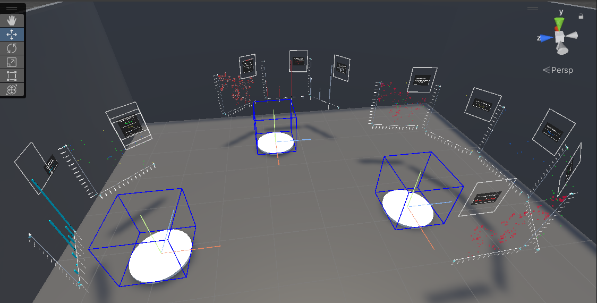
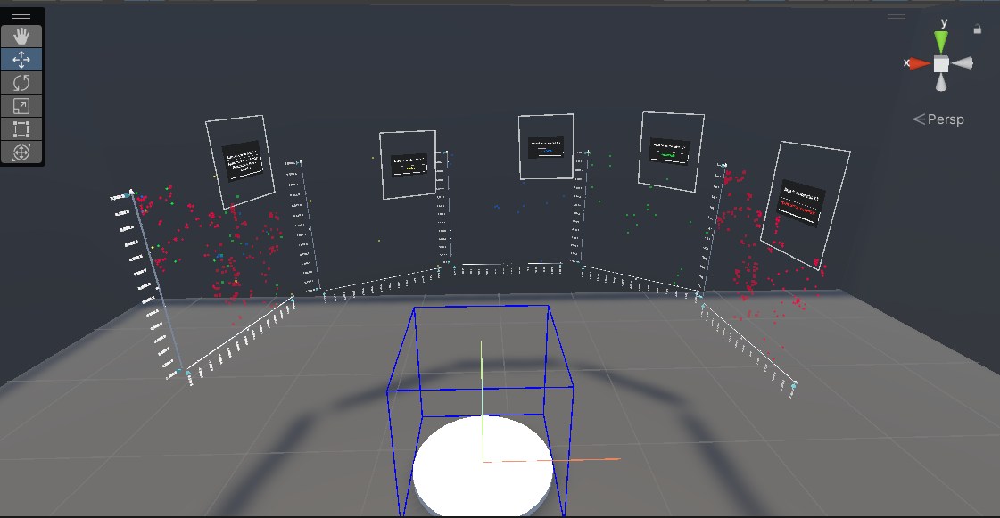
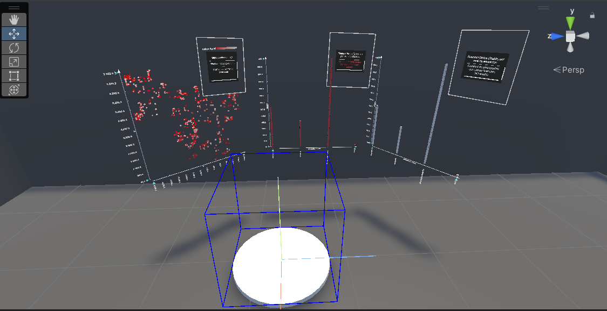
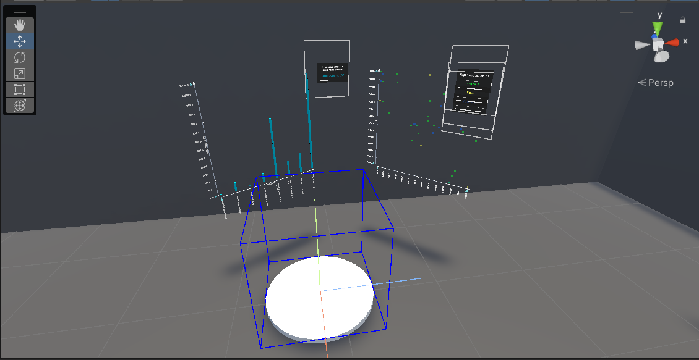

# Informe de Avance del Proyecto Final

**Alumno:** Nelzon Apaza  
**Curso:** Proyecto Final de Carrera II  
**Título del Proyecto:** *Analítica Inmersiva Colaborativa con Interacción Natural para Análisis de Datos Complejos*

---

## Descripción General

Este proyecto tiene como objetivo el desarrollo de una herramienta de analítica inmersiva y colaborativa que permita a los usuarios explorar y analizar datos complejos mediante una interacción natural en entornos tridimensionales.

La implementación se está realizando en **Unity**, aprovechando su robusto motor gráfico y sus capacidades para desarrollar experiencias interactivas e inmersivas. Para la visualización de datos, se utiliza el framework **IATK (Information Visualization Toolkit for Unity)**, que facilita la construcción de distintos tipos de gráficos y representaciones visuales en entornos 3D.

---

## Progreso Actual

### ✅ Implementaciones realizadas:

- Integración del framework **IATK** en Unity.
- Generación y prueba de gráficos como:
  - Gráficos de barras
  - *Scatterplots* (gráficos de dispersión)
- Construcción inicial del escenario colaborativo para la exploración de datos.

### 🔧 En desarrollo:

- Diseño y ambientación del entorno virtual en Unity.
- Aprendizaje y control avanzado de la plataforma Unity para modelar la interacción natural y colaborativa.
- Definición de las mecánicas de interacción que permitirán una experiencia más intuitiva para el análisis de datos.

---

## Capturas de Pantalla

### Escenario de Colaboración

**IMAGEN 1** 

> Visualización general del entorno donde se espera realizar la colaboración inmersiva.

### Visualización de Datos con IATK

**IMAGEN 2, 3, 4**  

> Ejemplos de gráficos generados con IATK, mostrando su potencial para representar datos de forma interactiva y tridimensional.

---

## Consideraciones

Tanto Unity como IATK son herramientas fundamentales en la construcción de este proyecto, pero **no constituyen el aporte principal**. Nuestra propuesta se enfoca en el **diseño de una experiencia colaborativa y natural para el análisis de datos complejos**, siendo estas herramientas los medios técnicos para lograrlo.

---

## Demostración

Para una mejor comprensión del avance logrado hasta la fecha, se puede acceder al siguiente video que muestra la ejecución del programa:  
🔗 **[Ver video de demostración](https://drive.google.com/file/d/1wbMFT1WL8HAm26mD7qDsddFJjgxsGOZq/view?usp=sharing)**

---

## Próximos Pasos

- Continuar con el diseño del entorno inmersivo.
- Integrar mecanismos de interacción natural (voz, gestos, etc.).
- Desarrollar funcionalidades colaborativas en tiempo real.
- Validar la herramienta con usuarios en escenarios reales de análisis de datos.

---

